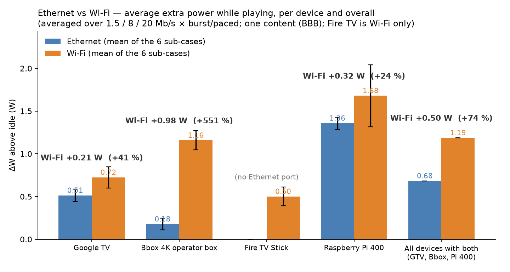
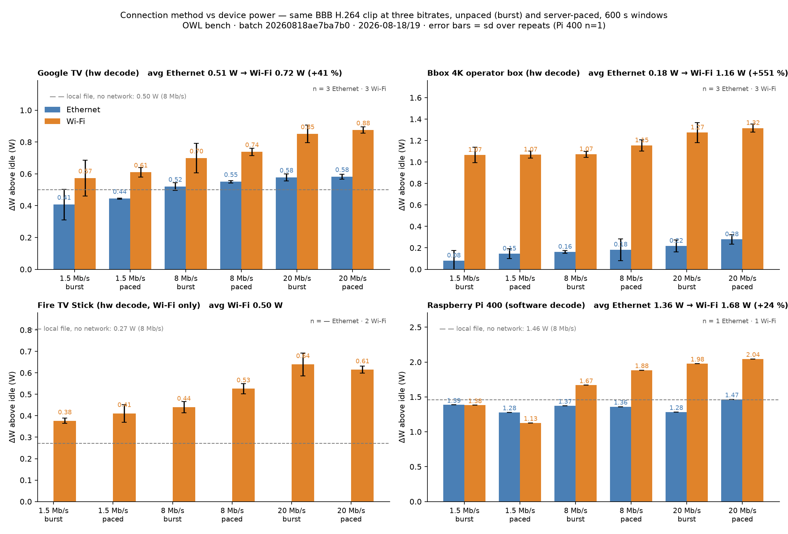

# Connection method as an energy variable — first campaign (CR-074), 2026-08-18 → 19

*Ben's question (2026-08-18): does the way a client is connected (Ethernet vs Wi-Fi vs no network) change its
power while playing, and does that depend on bitrate and on burst (VoD-style buffer-ahead) vs paced (live-like)
delivery? Stand-alone experiment on the OWL decode rig; not part of the codec panels.*

**Batch:** `20260818ae7ba7b0` — `https://wattlab.greeningofstreaming.org/decode/batch/20260818ae7ba7b0`
(62 jobs: 16 overnight + 14 Ethernet repeats + 32 daytime Wi-Fi). Scripts in this folder
(`net_feeder.py`, `net_feeder_pass2.py`, `wifi_day.py`, `make_charts.py`); cell table `netpath_cells.json`.

## Protocol

- Same content throughout: BBB 1080p60, H.264 (hardware-decoded on every STB, software on the Pi 400), at
  **1.5 / 8 / 20 Mb/s** (`bbbnet_h264_{1500,20000}k_20min.mp4` NVENC CBR from the ProRes reference; 8 Mb/s =
  the iso-bitrate family clip), **600 s windows**, headless realtime, protocol v3 (idle guard, 20-sample
  baseline, PLAYING gate, mid-window screenshot, trace-flat liveness).
- **Burst** = plain HTTP file fetch from the OWL origin (the player buffers ahead as it likes). **Paced** = the
  origin caps that response at 1.25× the clip rate (`?pace_kbps=`), so the player cannot run ahead — a
  live-edge approximation. **Local** = the file on the device (adb push / `/dev/shm`), no network at all.
- **Interface switching:** Pi 400 by `nmcli` per run (control + traffic over the interface under test, interfaces
  recorded mid-window); GTV and Bbox by **pulling the Ethernet cable** on 2026-08-19 morning (unrooted Android
  TV cannot drop Ethernet from the shell) — the boxes re-joined on Wi-Fi (`schwarz`, new DHCP addresses,
  followed via the `rig_target_overrides` setting); Fire TV Stick is Wi-Fi-only; C2 not switchable remotely.
- n: GTV/Bbox Ethernet 3, Wi-Fi 3 (one GTV Wi-Fi cell n=2: the first Wi-Fi start came up PAUSED and is excluded);
  Fire TV 2; Pi 400 1 (n=2 local). Bbox rows are near its idle drift on Ethernet (🔴/🟡) — the *difference* to
  Wi-Fi is far outside it.

## Results

**Google TV Streamer (hw decode)**

| sub-case | Ethernet | Wi-Fi |
|---|---|---|
| 1.5 Mb/s burst | +0.41 ± 0.10 (n=3) | +0.57 ± 0.11 (n=2) |
| 1.5 Mb/s paced | +0.44 ± 0.00 (n=3) | +0.61 ± 0.03 (n=3) |
| 8 Mb/s burst | +0.52 ± 0.02 (n=3) | +0.70 ± 0.09 (n=3) |
| 8 Mb/s paced | +0.55 ± 0.01 (n=3) | +0.74 ± 0.02 (n=3) |
| 20 Mb/s burst | +0.58 ± 0.02 (n=3) | +0.85 ± 0.05 (n=3) |
| 20 Mb/s paced | +0.58 ± 0.01 (n=3) | +0.88 ± 0.02 (n=3) |
| local file 8 Mb/s (no network) | +0.50 ± 0.02 (n=3) | |

**Bbox 4K operator box (hw decode)**

| sub-case | Ethernet | Wi-Fi |
|---|---|---|
| 1.5 Mb/s burst | +0.08 ± 0.10 (n=3) | +1.07 ± 0.07 (n=3) |
| 1.5 Mb/s paced | +0.15 ± 0.05 (n=3) | +1.07 ± 0.03 (n=3) |
| 8 Mb/s burst | +0.16 ± 0.01 (n=3) | +1.07 ± 0.03 (n=3) |
| 8 Mb/s paced | +0.18 ± 0.10 (n=3) | +1.15 ± 0.05 (n=3) |
| 20 Mb/s burst | +0.22 ± 0.06 (n=3) | +1.27 ± 0.09 (n=3) |
| 20 Mb/s paced | +0.28 ± 0.04 (n=3) | +1.32 ± 0.04 (n=3) |
| local file 8 Mb/s (no network) | — | |

**Fire TV Stick 4K (hw decode, Wi-Fi only)**

| sub-case | Ethernet | Wi-Fi |
|---|---|---|
| 1.5 Mb/s burst | — | +0.38 ± 0.01 (n=2) |
| 1.5 Mb/s paced | — | +0.41 ± 0.04 (n=2) |
| 8 Mb/s burst | — | +0.44 ± 0.03 (n=2) |
| 8 Mb/s paced | — | +0.53 ± 0.02 (n=2) |
| 20 Mb/s burst | — | +0.64 ± 0.05 (n=2) |
| 20 Mb/s paced | — | +0.61 ± 0.02 (n=2) |
| local file 8 Mb/s (no network) | +0.27 ± 0.05 (n=2) | |

**Raspberry Pi 400 (software decode)**

| sub-case | Ethernet | Wi-Fi |
|---|---|---|
| 1.5 Mb/s burst | +1.39 (n=1) | +1.38 (n=1) |
| 1.5 Mb/s paced | +1.28 (n=1) | +1.13 (n=1) |
| 8 Mb/s burst | +1.37 (n=1) | +1.67 (n=1) |
| 8 Mb/s paced | +1.36 (n=1) | +1.88 (n=1) |
| 20 Mb/s burst | +1.28 (n=1) | +1.98 (n=1) |
| 20 Mb/s paced | +1.47 (n=1) | +2.04 (n=1) |
| local file 8 Mb/s (no network) | +1.46 (n=1) | |
| Ethernet 8 Mb/s, Wi-Fi radio OFF | +1.39 (n=1) | |

## What we can say (one content, one codec, 600 s windows, n as stated)

1. **Ethernet delivery costs nothing measurable on the client** (note the bars in the charts are the *whole* playback cost above idle on each connection — decode + render + player + network — not the network share alone; the network share is read from the local-file control). GTV: local file +0.50 ± 0.02 W vs Ethernet HTTP
   +0.52 ± 0.02 W (8 Mb/s); Pi 400: Ethernet ≈ local across bitrates; Pi with the Wi-Fi radio OFF ≈ radio on
   (1.39 vs 1.37 W) — an idle radio is free too.
2. **Wi-Fi costs every device more, by very different amounts:** GTV **+0.21 W** on average (+0.16 at 1.5 Mb/s
   → +0.30 at 20 Mb/s); Bbox operator box **+0.98 W**, essentially flat across bitrate (≈ +1.0 W at 1.5 and 8,
   +1.05–1.1 at 20 Mb/s) — the largest single network effect on the rig, on a box whose H.264 decode itself is
   inside its idle noise; Pi 400 **+0.32 W** average but strongly bitrate-dependent (+0 at 1.5, +0.3–0.5 at 8,
   +0.6–0.7 W at 20 Mb/s); Fire TV (Wi-Fi only, vs its local file +0.27 W) +0.1 W at 1.5 Mb/s rising to
   +0.35 W at 20 Mb/s. Across the three devices measured on both interfaces: **Ethernet 0.68 W → Wi-Fi 1.19 W
   average, i.e. +0.50 W (+75 %)** while playing.
3. **Bitrate matters on every device, and on the STBs even on Ethernet with hardware decode:** GTV +0.41 → +0.58 W
   from 1.5 to 20 Mb/s (demux/decoder work, not the NIC); Bbox +0.08 → +0.22; on Wi-Fi the bitrate slope is
   steeper on the chips that handle Wi-Fi efficiently (GTV, Fire TV, Pi) and flat on the Bbox.
4. **Paced (live-like) vs burst: no consistent difference** at n=3 on the STBs (GTV ±0.03 W, Bbox +0.0–0.07 W);
   on the Pi paced is weak by construction (`ffmpeg -re` already reads at ~1× rate).

## What we would not say

- Anything about content: one clip family (BBB). The "average" in the summary chart is over bitrates and pacing,
  not content types.
- A per-device Wi-Fi figure as a device property: Wi-Fi power depends on the link (distance, band, router, radio
  power-save) — this is one rig, one router, one room.
- Anything about the Apple TV or the C2's network path (not switchable remotely; C2 rows are panel-dominated).

## Open

- Replicate with a second content (Meridian/Kranjska iso clips exist) and with the Fire TV on a wired adapter, if
  we want a device-level claim; ~~add a managed switch so the STB Ethernet↔Wi-Fi arm is scriptable~~ —
  **done: managed switch installed 2026-08-29.** Note (2026-09-03): the Bbox is now a headless/no-sink box
  (no HDMI cable) — its rows since then are the no-sink regime.
- The Bbox's ~1 W Wi-Fi premium deserves its own look (radio power-save off? 2.4 vs 5 GHz? the box's own
  network stack) before it is quoted as an operator-CPE property.
- Fold the Wi-Fi share into the decode findings' disclosure: a Wi-Fi-only client's decode rows carry it.
